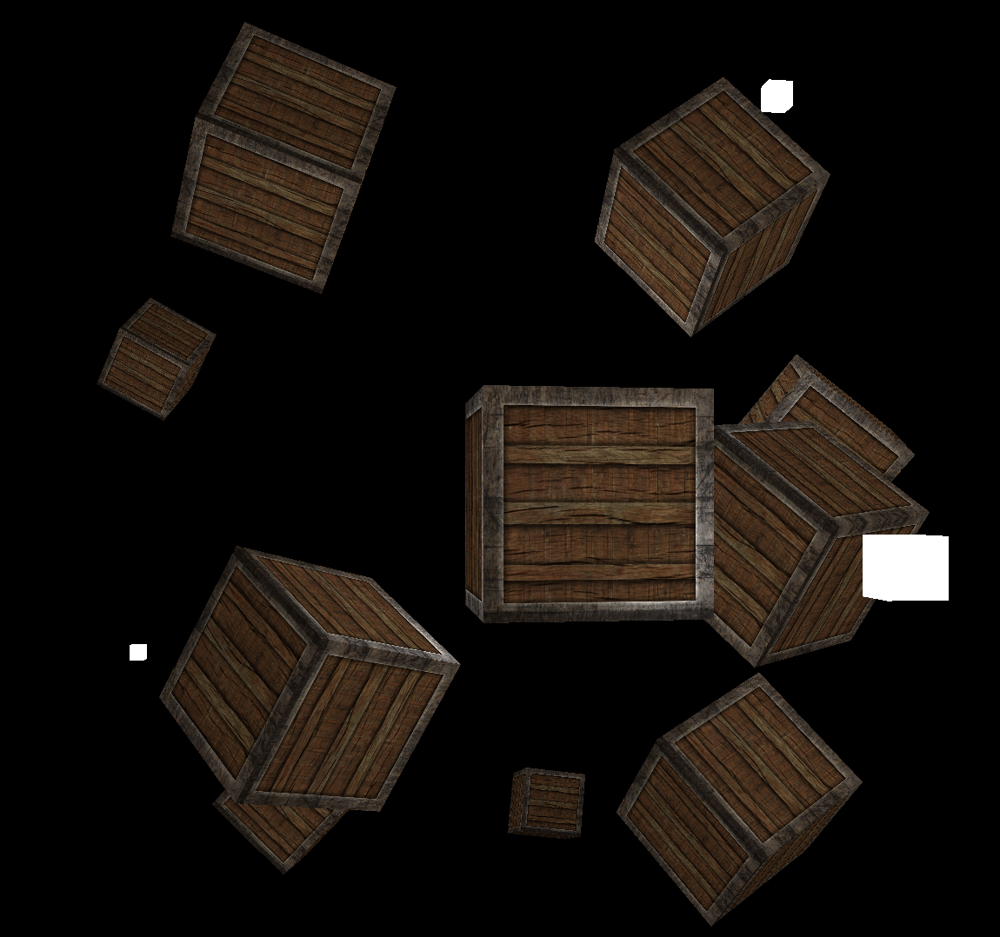
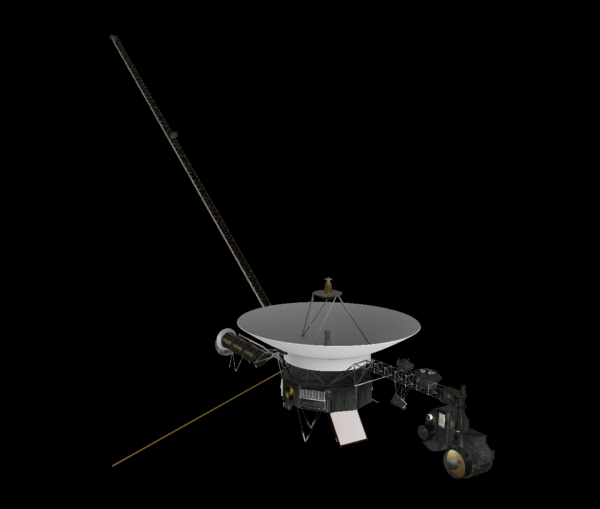
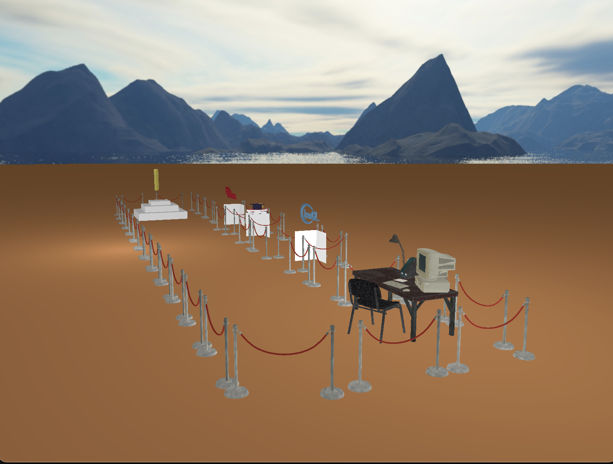
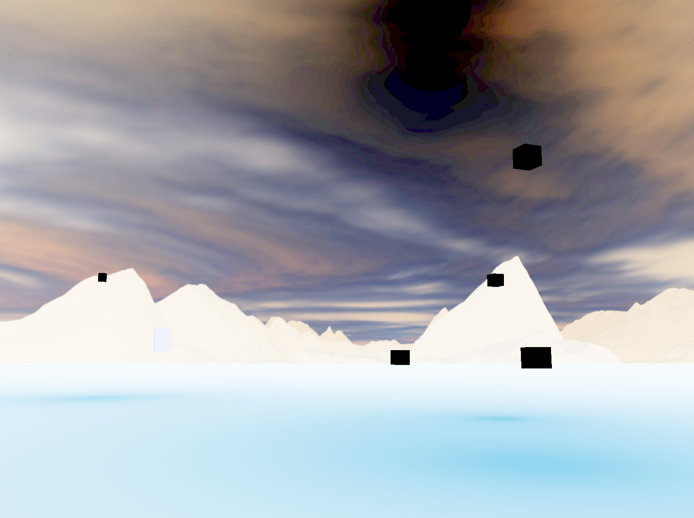
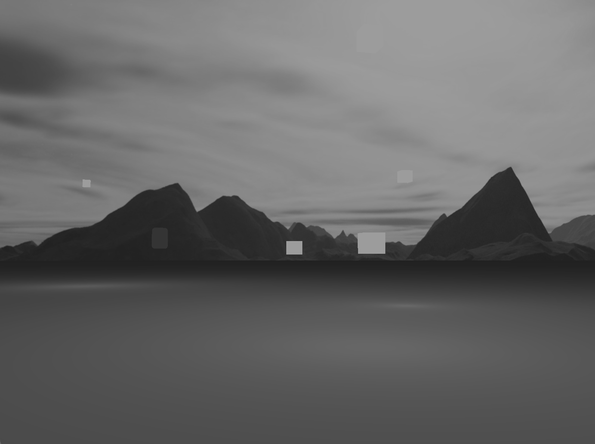
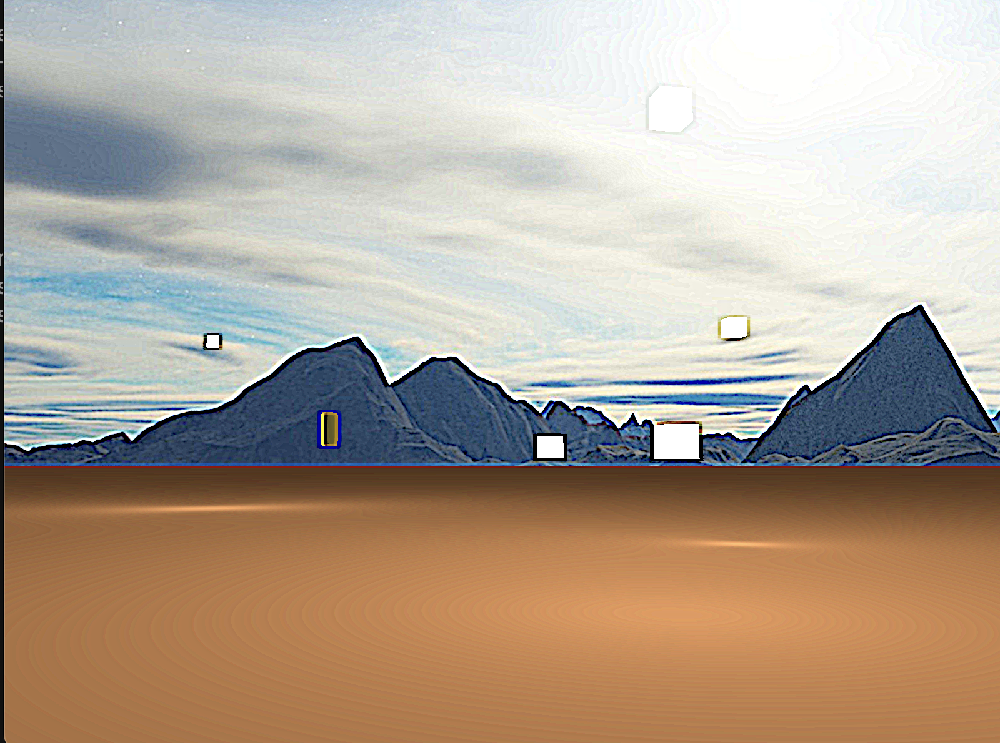
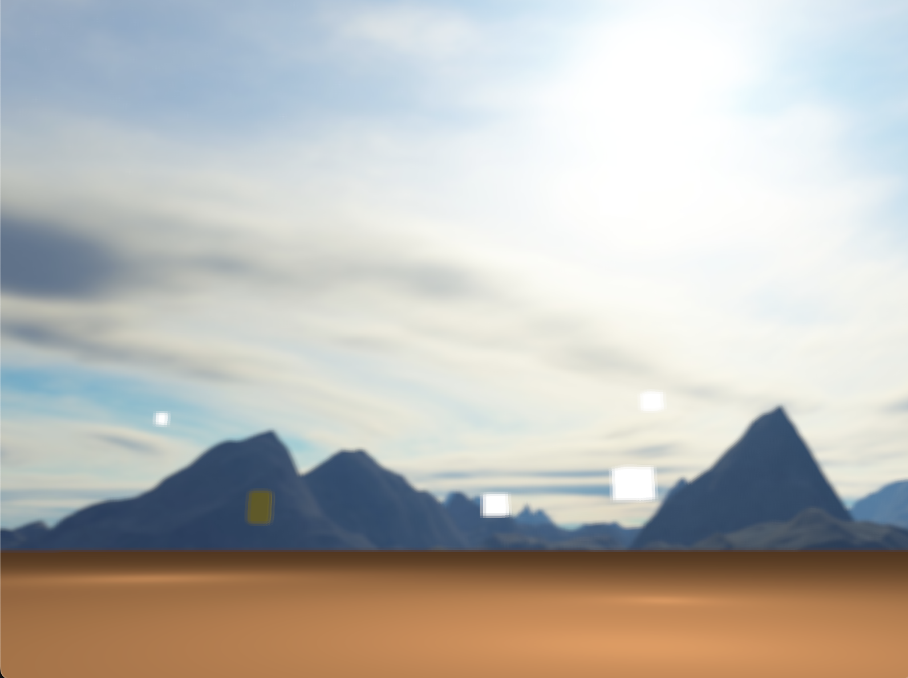
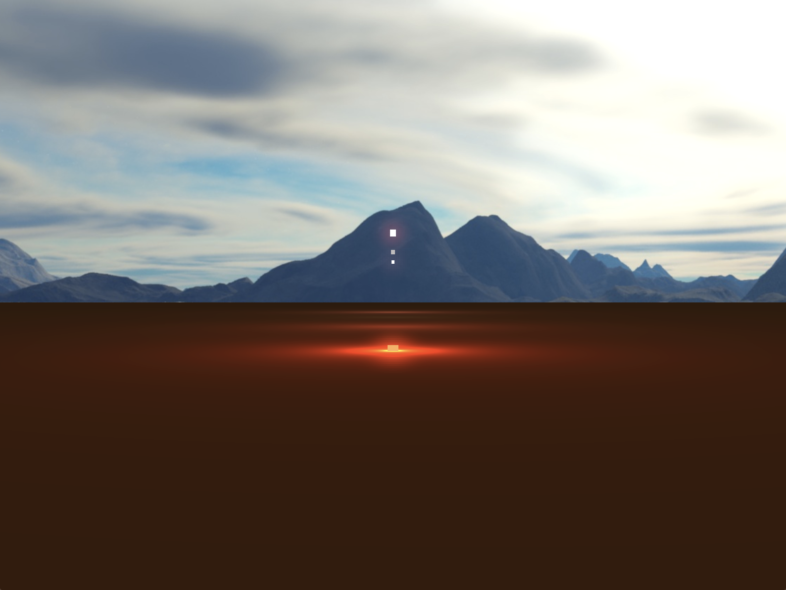
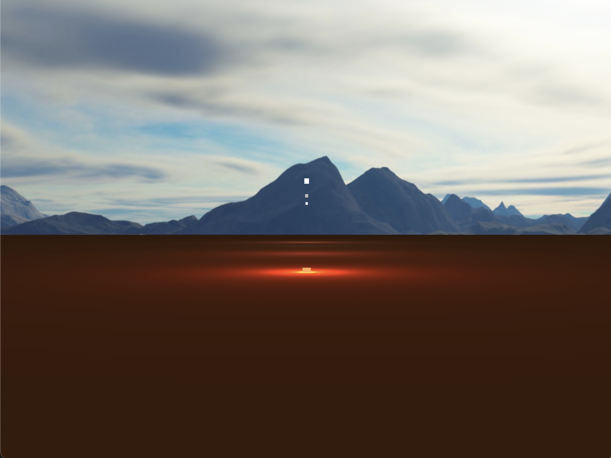

# Vulkan Graphics Demo

This is my personal repository for everything Vulkan related. In the next months i'm going to cook up a demo with all the graphics
knowledge i'll have accumulated thanks to the books and resources. Hope it is going to be something cool.

## 11th December: Phong shading
Look ma! That cube is lit!
Thanks to the awesome material at learnopengl.com i now have this beautiful scene to share

## 18th of December: Model loading
Oh boy what an endevoir this has been! Finally exiting the "Vulkan tutorial's comfort zone" and starting to head into sort of "unexplored" territory (at least for me).
I finally got the chance to get my hands dirty with multiple descriptor sets and really had to sit there thinking what could be the best possible strategy to upload
my precious data to the shaders. Currently i have been unable to get bindless texture working (i've tried, thanks MoltenVK!) due to "Macbeingapaininthearsetodevelopfor"-itis.
It is a rare and uncurable condition i'm afraid!
I've still managed to get it to work the ol' fashioned way by just simply allocating a descriptor set for each submesh.
Model matrix is uploaded as a push constant while view, projection and view direction are uploaded from another descriptor set, given their global status.
The code base is not in its best shape right now. Nothing is efficient (yet) as many resources are just reallocated without the need to, i just had to get something out to
start building a demo for my Rare internship cover letter.
Next days are going to be busy trying to build something cool, so no more progress until the end of December.

Next item on the menu will be: Resource cache, skyboxes, hopefully support for animation and bindless textures if they don't turn out to be a massive pain for a small gain.
Till next time :3 

## 10th of January: Skybox and audio 
I have to admit, recovering from these festive weeks has proven much MUCH tougher than originally anticipated.
New year's eve has been already 10 extremely short days ago, and it felt like its only been 5 minutes. sad :'( 
Anywho, lettuce at least cheer up with some sweet Vulkan progresses! On this week's menu: cubemaps! And audio capabilites ^^.
As well as some minor memory leak caught here and there. 
I also spent some time trying to compile the repo on Windows to ensure maximum compatibility and "shippability".
As a final note theh repo now supports git LFS to deal with the bigger model files. Future plans are now to improve the model loading code which is quite quick and dirty at the
moment and improve it as well as to add material support. 
Next on the list is also a fancy model cache, so i won't have to spam the GPU with redundant data!
Oh before i forget, i also formatted the with clang-format using Mozilla's style. Hope this makes it more readable ^^.
Hopeful at what the future has to offer ^^ to whoever's reading, i wish you a happy new year <3.

## 22nd of January: Color attachments et. al.
Its been a long 12 days ^^ I'm finally delving into what i "feel" is intermediate Vulkan stuff, as we're modifying tutorial constructs more and more to get to more interesting results.
This time I had the chance to review and dive deeper into Render Passes.
The old render pass was fresh out of the introductory tutorial oven and comprised of a single subpass. The next one takes a baby step in the advanced direction and adds a second subpass. 
The first one uses the pipeline to draw into an intermediate buffer while the latter takes the intermediate buffer and applies some goofy post-processing effects. Later this might be used for cool effects like bloom, tone-mapping and HDR.

Following are some cool screenshots of the end result.

    
    
    
    

## 13th of February: Gloomy Bloomy post-processing effects
This has been such a massive milestone for me, the excitement and satisfaction i felt today is something i will remember for a long time =D :3
It took a massive refactoring, a broken heart and some creativity and voila'! Bloom =D 
I feel like the beast that is Vulkan has been somewhat tamed now. The refactoring process and the bloom pipeline really allowed me to get an even fuller and complete picture of the underlying
systems that drive this marvelous API. Here are some juicy screenshots i hope you will enjoy, dear reader <3.

    
    

